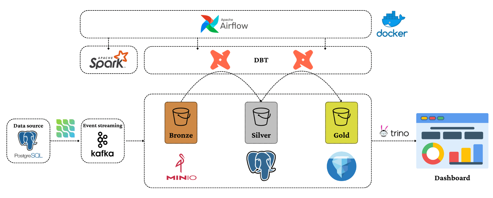

# 🏞️ Data Platform

A local CDC → lakehouse platform, built with Docker Compose. Postgres row changes are streamed
via Debezium into Kafka, sunk directly into Iceberg `bronze` tables by a Kafka Connect Iceberg
sink (no intermediate file landing zone), transformed with dbt running on a Spark Thrift server
into `silver`/`gold` Iceberg tables, queried through Trino, and orchestrated by Airflow.

## 🏗️ Architecture



**Layering:** **bronze** (raw CDC event log, Iceberg, Kafka-Connect-managed — one row per CDC
event, no dedup) → **silver** (dedup + cleaned + typed, dbt-managed) → **gold** (business marts,
dbt-managed). Airflow's DAG mounts the top-level `dbt/` project straight into its containers and
runs it against the Spark Thrift server via a dedicated dbt virtualenv baked into the Airflow
image — no Docker socket, no separate dbt service in the orchestration path.

## 🧩 Services

| Layer | Service | Purpose | Host port |
|---|---|---|---|
| Source | `postgres` | BikeStores OLTP DB, `wal_level=logical` | 5432 |
| Streaming | `kafka`, `schema-registry`, `akhq`, `kafka-connect` | Debezium source + Iceberg sink connectors | 8080 (AKHQ), 8083 (Connect) |
| Lakehouse | `minio`, `iceberg-rest`(+db), `spark` | Object store, REST Catalog, Spark Thrift | 9001 (MinIO), 10000 (Thrift) |
| BI | `trino` | Interactive SQL over bronze/silver/gold | 8085 |
| Orchestration | `airflow-*` | `lakehouse_pipeline` DAG: connector checks → dbt run → dbt test (dbt runs from the Airflow image's own venv) | 8088 |

## 🚀 Quickstart

```bash
cd docker
./start-all.sh
```

`start-all.sh` does everything, in order: creates `../.env` from `.env.example` if missing →
`./download-dependencies.sh` (fetches every jar/plugin the custom images need) →
`./build-all-images.sh` → brings up every service across every profile → registers the Debezium
source and Iceberg sink connectors → waits for the sink's first commit to create the `bronze`
tables → runs `dbt run` + `dbt test`. It's idempotent — re-running reuses the existing `.env`,
downloads, and connectors. When it finishes it prints every service endpoint.

To tear everything down and wipe all containers + volumes:

```bash
./start-all.sh reset
```

## 🧱 Running layers in isolation

Bring up a subset of the stack directly with Docker Compose profiles (`core`, `streaming`,
`lakehouse`, `bi`, `orchestration`) instead of the full `start-all.sh` run:

```bash
cd docker
cp ../.env.example ../.env               # first time only
./download-dependencies.sh && ./build-all-images.sh
docker compose --env-file ../.env --profile core --profile lakehouse --profile streaming up -d
docker compose --env-file ../.env ps
docker compose --env-file ../.env --profile '*' down       # stop everything
docker compose --env-file ../.env --profile '*' down -v    # stop + wipe volumes
```

Register the connectors once `core` + `streaming` (+ `lakehouse` for the sink) are up:

```bash
set -a; source ../.env; set +a
envsubst < kafka-connect/connectors/debezium-postgres-source.json | \
  curl -s -X POST -H "Content-Type: application/json" --data @- http://localhost:8083/connectors
curl -s -X POST -H "Content-Type: application/json" --data '{"namespace": ["bronze"]}' http://localhost:8181/v1/namespaces
envsubst < kafka-connect/connectors/iceberg-sink.json | \
  curl -s -X POST -H "Content-Type: application/json" --data @- http://localhost:8083/connectors
```

Run dbt directly (needs `lakehouse` + `orchestration` up — this runs it through the Airflow
image's own dbt venv, the same one the DAG uses):

```bash
DBT="/opt/dbt-venv/bin/dbt --profiles-dir /opt/airflow/dbt --project-dir /opt/airflow/dbt"
docker compose --env-file ../.env run --rm --no-deps -e DBT_TARGET_PATH=/tmp/dbt-target -e DBT_LOG_PATH=/tmp/dbt-logs airflow-scheduler $DBT run
docker compose --env-file ../.env run --rm --no-deps -e DBT_TARGET_PATH=/tmp/dbt-target -e DBT_LOG_PATH=/tmp/dbt-logs airflow-scheduler $DBT test
```

Query gold with Trino:

```bash
docker exec -it trino trino
```
```sql
SHOW SCHEMAS FROM iceberg;                                   -- bronze, silver, gold
SELECT * FROM iceberg.gold.gold_daily_revenue ORDER BY 1 DESC LIMIT 10;
```

Airflow UI: **http://localhost:8088** (`admin`/`admin` by default) — unpause and trigger
`lakehouse_pipeline`.

## 💡 Notable design decisions

- **Iceberg REST Catalog, not Hive Metastore** — `apache/iceberg-rest-fixture` backed by Postgres
  (`JdbcCatalog`), avoiding the Hadoop/`hadoop-aws`/AWS-SDK jar-compatibility surface.
- **Single MinIO bucket** — every Iceberg namespace lives under one `lakehouse` bucket's
  `warehouse/` prefix; bucket count carries real per-bucket config/limit costs.
- **No `raw/` landing zone** — the Apache-native Iceberg Kafka Connect sink
  (`org.apache.iceberg.connect.IcebergSinkConnector`) writes structured rows straight into
  `bronze` tables; the databricks fork is frozen at `0.6.19` with an open multi-table-routing bug
  ([apache/iceberg#13457](https://github.com/apache/iceberg/issues/13457)).
- **`docker/downloads/`** — one shared, gitignored folder for every jar/plugin fetched at build
  time (`download-dependencies.sh`), so Dockerfiles just `COPY` from it instead of hitting the
  network during `docker build`.
- **dbt-spark schema-as-catalog workaround** — the thrift dbt-spark adapter has no real 3-level
  `catalog.schema.table` addressing, so the dbt `schema` itself is set to the literal string
  `lakehouse.silver` / `lakehouse.gold`; `macros/generate_schema_name.sql` passes it through
  unmodified.
- **dbt runs in its own venv inside the Airflow image** (`/opt/dbt-venv`), not Airflow's own
  Python env — Airflow 2.10 and dbt-core 1.8 pin conflicting `click`/`jinja2`/`protobuf` ranges.

## 📂 Repository structure

```
.
├── README.md
├── project_plan.md          # phase-by-phase plan
├── AGENTS.md                # guidelines this build follows
├── .env.example
├── bike-store-data/         # original SQL Server source scripts (reference only)
├── docker/
│   ├── docker-compose.yaml
│   ├── download-dependencies.sh  # fetches every jar/plugin into downloads/ (gitignored)
│   ├── build-all-images.sh       # verifies downloads/, then `docker compose build`s every custom image
│   ├── start-all.sh              # one command: download → build → up → register → dbt (+ reset)
│   ├── downloads/                # gitignored — jars + confluent-hub plugin dirs
│   ├── postgres/             # CUSTOM: Dockerfile + configs/{init.sql,postgresql.conf}
│   ├── iceberg-rest/         # CUSTOM: Dockerfile (context: .., COPYs downloads/postgresql.jar)
│   ├── kafka-connect/        # CUSTOM: Dockerfile (context: ..) + connectors/
│   │   └── connectors/{debezium-postgres-source,iceberg-sink}.json
│   ├── spark/                # CUSTOM: Dockerfile (context: ..) + configs/spark-defaults.properties
│   ├── airflow/              # CUSTOM: Dockerfile (apache/airflow + dbt in /opt/dbt-venv, runs the DAG's dbt tasks)
│   └── trino/                # CONFIG ONLY — configs/catalog/iceberg.properties
├── dbt/                       # top level — project only, no Dockerfile here
│   ├── dbt_project.yml
│   ├── profiles.yml           # spark adapter, method: thrift, no secrets
│   ├── macros/generate_schema_name.sql
│   └── models/{silver,gold}/  # *.sql + schema.yml (not_null/unique tests) — bronze is Kafka-Connect-managed
└── airflow/                   # top level — dags/ (bind-mounted into the Airflow image)
    └── dags/
        ├── pipeline_dag.py            # lakehouse_pipeline: readiness gates → dbt run → dbt test
        └── operators/                 # reusable custom operators
            └── dbt_spark_operator.py  # DbtSparkConfig + DbtSpark{Run,Test,Debug,…}Operator
```

## ✅ Prerequisites

- Docker + Docker Compose v2
- 32 GB RAM recommended (16 GB is a painful floor); 40 GB+ free disk
- Compose **profiles** (`core`, `streaming`, `lakehouse`, `bi`, `orchestration`) let you bring up
  one layer at a time instead of all containers at once
