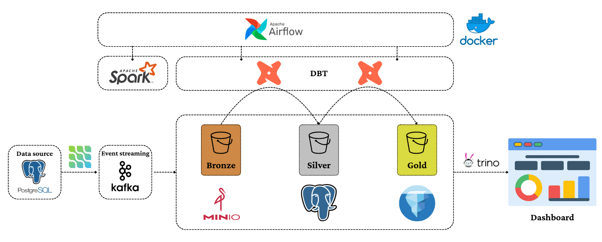

# 🏞️ Data Platform

A local CDC → lakehouse platform on Docker Compose. Postgres changes are captured by Debezium,
streamed through Kafka, landed in Apache Iceberg by a Kafka Connect sink, transformed with dbt on
Spark, queried with Trino, and orchestrated by Airflow.

## 🏗️ Architecture




| Layer | Content | Managed by |
|---|---|---|
| **bronze** | Raw CDC event log: one row per change (`r`/`c`/`u`/`d`), never updated | Kafka Connect Iceberg sink, commits every 15 s |
| **silver** | Current state per key: latest event wins, deletes removed (incremental merge) | dbt |
| **gold** | Business marts: `gold_daily_revenue`, `gold_customer_lifetime_value` | dbt |

## 🧩 Components

| Component | Role |
|---|---|
| PostgreSQL | Source OLTP database (BikeStores), `wal_level=logical` |
| Debezium Postgres connector | Captures row changes from the WAL |
| Apache Kafka (KRaft) | Event streaming, one topic per table |
| Schema Registry / Kafka Connect | Avro schemas / runs the source and sink connectors |
| AKHQ | Kafka UI |
| Apache Iceberg (sink, Spark runtime, REST catalog) | Table format and catalog for all layers |
| MinIO | S3-compatible object store (built from source) |
| Apache Spark (Thrift server) | SQL engine for dbt |
| dbt-core / dbt-spark | silver and gold transformations + tests |
| Trino | Interactive SQL over all layers |
| Apache Airflow | Orchestrates dbt (`lakehouse_pipeline` DAG) |

Services are grouped into Compose profiles (`core`, `streaming`, `lakehouse`, `bi`, `orchestration`)
so each layer can run on its own. A Python **data generator** (`docker/data-generator/`) simulates
shop activity on the source to keep CDC flowing.

## 📂 Repository structure

```
.
├── README.md
├── CLAUDE.md                   # guidelines this build follows
├── .env.example                # credentials + host ports
├── Lakehouse_architecture.png
├── docker/
│   ├── docker-compose.yaml     # all services, grouped by profile
│   ├── start-all.sh            # one command: download → build → up → register → dbt (+ reset)
│   ├── download-dependencies.sh
│   ├── build-all-images.sh
│   ├── postgres/               # source DB: init.sql, postgresql.conf
│   ├── kafka-connect/          # Debezium + Iceberg sink plugins, connectors/*.json
│   ├── minio/                  # builds minio + mc from source
│   ├── iceberg-rest/           # REST catalog + Postgres JDBC driver
│   ├── spark/                  # Iceberg/S3 jars, spark-defaults.conf
│   ├── trino/                  # catalog config only (no Dockerfile)
│   ├── airflow/                # Airflow image with dbt in /opt/dbt-venv
│   └── data-generator/         # Python simulator for source changes
├── dbt/
│   ├── dbt_project.yml
│   ├── profiles.yml            # spark adapter, thrift method
│   ├── macros/                 # generate_schema_name
│   └── models/                 # silver/ (incremental), gold/ (tables)
├── airflow/
│   └── dags/                   # pipeline_dag.py: wait for Spark → dbt run → dbt test
└── docs/
    ├── QUICK-START.md
    ├── TROUBLESHOOTING.md
    └── OPERATIONS.md
```

## 📚 Docs

- [Quick start](docs/QUICK-START.md) — spin up the platform, UIs, example queries
- [Troubleshooting](docs/TROUBLESHOOTING.md) — common issues and the commands to check them
- [Operations](docs/OPERATIONS.md) — Iceberg maintenance, schema evolution, future improvements
